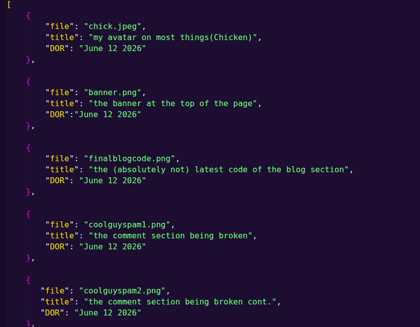

## I made a gallery section

*June 12 2026 8:34am*

I made a gallery section. It's mostly a place for me to display all the photos throughout the website. It doesnt have the logos from my homepage tho bc it's technically a seperate project, and also bc i stored it in a different folder.

It works by first checking a json list made up of json lists that kinda looks like this:

This list provides: the file name, an image title, and the date i put it in the files. Then it forEaches the file name, then creates some html elements to put the information in, and adds it to the page.

Very simple, very easy, only like 2 hour project